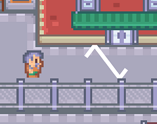

# The Electromancer
A game made for the [WGD](https://twitter.com/WGDSoc) Reflections (2019) Game Jam.

## Overview
The theme for this game was "Reflections" so a common early idea is a projectile that reflects off surfaces - this is the approach I took. The aim is to take out as many townspeople as possible using your lightning bolt, scoring combos by hitting multiple people in a single burst. Collecting your bolt before its timer is up will result in bonus points.

The restrictions I had in mind for this game jam were to use assets online wherever possible and to focus on a single mechanic.

### Assets
This project uses the following assets:

- ["RPG Urban Pack" by Kenney](https://www.kenney.nl/assets/rpg-urban-pack).

## Software
This project was created using Unity 2019.2.0f1.

## Authors
This game was created by [Daniel Ilett](https://github.com/daniel-ilett).

## Release
This game was created as part of [Warwick Game Design](https://twitter.com/WGDSoc)'s Reflections (2019) game jam and was completed in time for the game showcase on October 17th. 

Thanks for playing my games!

💙
